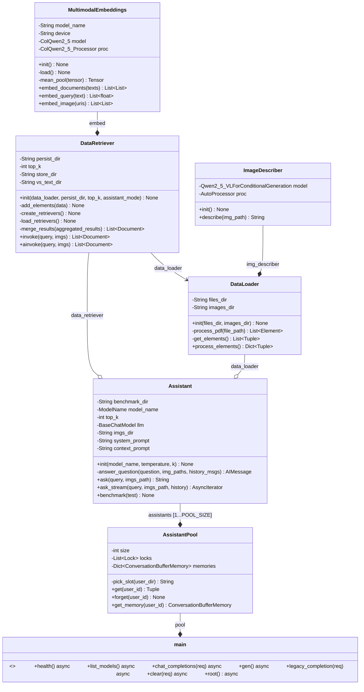

Documentación del asistente virtual

## Overview

El funcionamiento del asistente virtual está sustentado en dos tecnologías: un servidor Ollama para la inferencia del LLM en local y un sistema RAG (Retrieval Augmented Generation) para proporcionar al modelo el contexto necesario, con datos scrapeados de la wiki de MyTAO y otras guías del ayuntamiento.

El proceso, a vista de pájaro, tiene las siguientes fases:

1. **Extracción del texto, tablas e imágenes de los pdfs.** Sin entrar en detalles de implementación, particionamos cada uno de los pdfs en elementos (fundamentalmente, fragmentos de texto, tablas e imágenes) y los guardamos en memoria para procesamiento posterior (no en el caso de las imágenes, que se mantienen en disco y en memoria solo tenemos las rutas).
2. **Procesamiento de los elementos extraídos.** De nuevo, tampoco entraremos en detalles, meramente hay que tener en cuenta que, una vez extraídos, hay que hacer algunos procesamientos para alimentar a la siguiente fase.
3. **Generación de la base de datos vectorial.** El sistema RAG se sustenta sobre el uso de una base de datos vectorial. Como ya hemos comentado, en la fase de extracción iteramos sobre el conjunto de pdfs, de manera que establecemos una suerte de jerarquía en donde todo el texto del pdf (esto incluye descripciones, en el caso de las imágenes, y código html en el caso de las tablas, generadas por un modelo VLM) se considera el "padre", mientras que los fragmentos de texto (de nuevo, incluyendo el texto inferido de tablas e imágenes) se procesan como los "hijos". De manera más precisa, dado el conjunto de tokens padre $P=\{t_1,t_2,...,t_n \}$, este se subdivide en $m$ subconjuntos $H_i \subset P, \forall i \in \{1,2,...,m\}$ y, posteriormente, se usa una matriz de "embedding" $W_E$ preentranada que calcula los vectores en el espacio latente para cada token de los subconjuntos, $v_j \in \mathbb{R}^{1 \times D}$, donde $D$ es la dimensión oculta. Los vectores de cada subconjunto hijo se promedian, y obtenemos un vector "resumen" para cada fragmento hijo del texto original, $w_i \in \mathbb{R}^{1 \times D}$, de manera que, cuando le llega una consulta de un usuario con vector resumen $q \in \mathbb{R}^{1 \times D}$, la base de datos vectorial devolverá los $k$ documentos con vectores resumen más similares (ya que los documentos padre se encuentran indexados). El diagrama adjuntado más abajo ilustra el proceso, aunque hay que tener en cuenta que la fase de indexación se realiza para todos los documentos $P$. Las $m$ particiones del conjunto $P$ tampoco se realizan de forma explícita, lo realiza de forma transparente la librería extractora. Esto que se acaba de exponer no es del todo correcto: en realidad, establecemos una cota superior para el tamaño de un documento, de manera que tendremos varios padres por documento pdf si el tamaño de este la supera. Esto es para no abotargar al LLM en inferencia, ya que tamaños de documento muy grandes empeoran el tiempo de inferencia y el rendimiento del modelo.
4. **Inferencia.** Se buscan los $k$ documentos que la base de datos vectorial considera más relevantes para la consulta del usuario y se añaden al contexto del LLM hospedado en un servidor ollama.


Otros detalles importantes: la extracción, el preprocesamiento y la generación de la base de datos vectorial son procesos costosos computacionalmente que necesitaron de dos semanas de computación para ejecutarse (debido a la muy alta cantidad de pdfs que se optó por usar). En los primeros, hubo diversas caídas en los servidores del ayuntamiento, en las cuales se perdió mucho tiempo de cómputo. Por tanto, también se implementó un sistema de checkpointing por medio de serialización para mantener los estados intermedios en disco, el cual se discutirá más adelante. Por último, la aplicación levanta una API cuyo frontend es un chat sencillo para dialogar con el asistente.

## Detalles de la implementación a nivel de sistemas

|     |     |
| --- | --- |
| **Servidor desde el que se ejecuta** | 10.1.1.202 (servidoria) |
| **Puerto que expone la API** | 8000 |
| **Ruta en donde se encuentra el código** | /opt/assistant/ |
| **Nombre del servicio que mantiene la API** | assistant.service |
| **Servidor web que expone el frontend** | /etc/nginx |
| **Directorio de la configuración de nginx** | /etc/nginx/sites-available |
| **Directorio donde se encuentra el código del frontend** | /var/www/chat |
| **Servidor de inferencia para LLMs** | ollama |
| **Ruta de los ficheros de configuración de los servicios** | /etc/systemd/system/ |
| **Ruta del entorno virtual de Python con las dependencias del proyecto** | /home/administrador/.pyenv/versions/assistant |

Para lanzar la aplicación, deberemos seguir los siguientes pasos:

1. Replicar el entorno virtual con ``pyenv``. Para ello, deberemos tener ``pyenv`` junto con ``pyenv-virtualenv`` en nuestro sistema debian, ejecutando lo siguiente:
  - Instalar dependencias de pyenv y pyenv-virtualenv: ``sudo apt install -y make build-essential libssl-dev zlib1g-dev libbz2-dev libreadline-dev libsqlite3-dev wget curl llvm libncurses5-dev libncursesw5-dev xz-utils tk-dev libffi-dev liblzma-dev git``
    
  - Instalamos propiamente ambas herramientas: ``curl https://pyenv.run | bash``
    
  - Agregar algunas líneas a la configuración de bash:
    
    ``echo 'export PYENV_ROOT="$HOME/.pyenv"' >> ~/.bashrc``
    
    ``echo 'command -v pyenv >/dev/null || export PATH="$PYENV_ROOT/bin:$PATH"' >> ~/.bashrc``
    
    ``echo 'eval "$(pyenv init -)"' >> ~/.bashrc``
    
    ``echo 'eval "$(pyenv virtualenv-init -)"' >> ~/.bashrc``
    
  -  Recargar la configuración: `source ~/.bashrc`
    

2. Crear el propio entorno a partir del fichero ``requirements.txt``. Para ello, seguimos los siguientes pasos:
  - Creamos el entorno vacío de python 3.12: ``pyenv virtualenv 3.12 assistant``
    
  - Activamos el entorno: ``pyenv activate assistant``
    
  - Instalamos pip, que es la herramienta de manejo de librerías para python: ``sudo apt install pip``
    
  - Comprobamos que pip esté actualizado: ``pip install --upgrade pip``
    
  - Instalamos librerías con pip: ``pip install -r requirements.txt``
    

A continuación, deberemos tener disponible este repositorio de código en la máquina debian donde deseemos ejecutar la aplicación. Los ficheros de configuración están preparados para las rutas específicas que se han mencionado antes, de manera que, si no los modificamos, el código deberá estar en ``/opt/assistant``, y toda la carpeta deberá pertener al usuario administrador, lo cual podemos hacer con ``sudo chown -R administrador:administrador /opt/assistant``. De la misma forma, los ficheros de configuración también están preparados para hacerlo todo con el usuario administrador, de manera que deberemos tener pyenv en su home, no en el root.

Una vez tenemos el código y el entorno virtual, podemos configurar el servidor nginx:

- Instalamos el paquete correspondiente: ``sudo apt install nginx``
  
- Deberemos asegurarnos de tener ``index.html`` en ``/var/www/chat``. Asimismo, deberemos establecer los permisos adecuados para que nginx pueda acceder al fichero: ``sudo chown -R www-data:www-data /var/www/chat`` y ``sudo chmod -R 755 /var/www/chat``
  
- De la misma manera, debemos tener el fichero de configuración de este repositorio, ``chat``, en ``/etc/nginx/sites-available/``, y establecer un enlace simbólico, ``sudo ln -s /etc/nginx/sites-available/chat /etc/nginx/sites-enabled/``
  
- Reiniciamos nginx: ``sudo systemctl restart nginx``. Cabe destacar que es conveniente que, antes de reiniciar, hagamos el siguiente punto, porque nginx dará error lo más seguro.
  

A continuación , tenemos que configurar el servicio de systemd que nos expone nuestra API:

- Primero, copiamos el fichero de configuración ``assistant.service`` a ``/etc/systemd/system``
  
- A continuación, establecemos los permisos adecuados: ``sudo chmod 644 /etc/systemd/system/assistant.service``
  
- Recargamos el demonio de systemctl para que se dé cuenta del nuevo fichero: ``sudo sytemctl daemon-reload``
  
- Lo habilitamos para que el servicio arranque siempre que la máquina también lo haga (con la opción --now para que también se inicie sin necesidad de reiniciar el servidor): ``sudo systemctl enable --now assistant.service``. Para parar el servicio, ``sudo systemctl stop assistant.service``, para reiniciarlo, ``sudo systemctl restart assistant.service``
  
- Comprobamos su estado con ``sudo systemctl status assistant.service``. Otra herramienta relevante es ``journalctl`` para leer los logs y ver si se producen errores; con la orden ``sudo journalctl -fu assistant.service`` podemos ver los logs en tiempo real, y con ``sudo journalctl -u assistant.service -n 100`` podemos ver las últimas 100 (o las que queramos) líneas de logs.
  
- Hay que tener en cuenta que el proceso lo que hace es lanzar un servidor web ``uvicorn`` desde el propio entorno de python y a través del puerto 8000, por lo que hay que asegurarse de que el puerto está expuesto.
  

IMPORTANTE, a lo largo de este documento se mencionará pero lo comentamos aquí, la generación de la base de datos vectorial es un proceso muy costoso. Dicha base de datos ya está generada, almacenada y lista para usarse en inferencia en los directorios que se mencionan más abajo, hay que tener cuidado con ello. No obstante, si se quiere volver a generar, contamos con el script que se comenta también abajo.

## Implementación a nivel de programación

### Árbol de ficheros del proyecto

A continuación se presenta la estructura del directorio /opt/assistant desde donde cuelga todo el código del proyecto:

- **/config/** En este directorio tenemos los ficheros de configuración necesarios.
  - **/config/assistant.service** Para el servicio de systemd que mantiene la API.
  - **/config/chat** Fichero con la configuración de nginx.
- **/env/** Carpeta donde se encuentran las dependencias del proyecto.
  - **/requirements.txt** Fichero con las librerías del entorno virtual de python usado.
- **/web/** En este directorio se encuentra todo el código html y javascript que sirve la API.
  - **/web/index.html** Tenemos un único fichero que encapsula todo el código mencionado.
- **/data/** Aquí es donde están todos los pdfs usados para la generación de la base de datos vectorial.
- **/benchmark/** Directorio que se utilizó para guardar los resultados de las evaluaciones de diferentes modelos e hiperparámetros.
- **/checkpoints/** Carpeta donde se guardan los estados intermedios mencionados para la generación de la base de datos.
  - **/checkpoints/child_texts.jsonl** Serialización en json de los elementos de tipo texto de los pdfs procesados. Incluye fragmentos de texto simple del fichero así como descripciones y código html inferidos por medio de un VLM. Se guarda el contenido del texto y otros tantos metadatos, fundamentalmente el ID del documento original.
  - **/checkpoints/child_images.jsonl** Serialización en json de los elementos imagen de los pdfs procesados. Sencillamente se guardan las rutas en el sistema de ficheros junto con el ID del documento al que pertenecen.
  - **/checkpoints/parents.jsonl** Serialización en json de los elementos padres. Se guarda todo el contenido de texto, incluidas inferencias del VLM, y otros metadatos como el ID.
  - **/checkpoints/element_tuples.jsonl** Hasta ahora, toda la serialización vista era concerniente a la fase de procesamiento posterior a la extracción. En este json se almacenan todos los elementos conseguidos de la primera fase de extracción. Como adelanto, esta división es necesaria ya que la libería que extrae elementos tiene unos tipos de datos distintos a la librería que maneja la base de datos vectorial.
  - **/checkpoints/current_pdf.txt** Necesario para mantener en disco el pdf por el que nos quedamos procesando.
- **/figures/** Directorio donde se encuentran las imágenes extraídas.
- **/models/** Carpeta que contiene algunos modelos en local, en particular, el embedding multimodal usado para la generación y consulta de la base de datos vectorial, y el VLM usado para describir imágenes y tablas en la generación de la base de datos (un modelo pequeño ya que uno grande produciría mucho overhead para un proceso que ya de por sí es muy pesado).
- **/modules/** Directorio que contiene gran parte del código del backend.
  - **/modules/assistant.py** Contiene la clase ```Assistant```, que abstrae el propio asistente, de manera que se encarga de lanzar las consultas al servidor ollama junto con el contexto devuelto por la base de datos vectorial.
  - **/modules/data_loader.py** Contiene la clase ```DataLoader```, que abstrae las dos primeras fases comentadas anteriormente, la extracción y el preprocesamiento previo a la generación propia de la base.
  - **/modules/data_retriever.py** Contiene la clase ```DataRetriever```, que abstrae a la propia base de datos vectorial, de manera que contiene todo el código relacionado con su generación y, una vez obtenido, la inferencia.
  - **/modules/image_describer.py** Contiene la clase ```ImageDescriber```, que abstrae al VLM usado para la inferencia de descripciones de elementos de tipo no-texto en la generación.
- **/storage/** Mantiene la base de datos vectorial en disco.
- **/benchmark.py** Script para la evaluación del asistente por medio de un test de MyTAO.
- **/generate_rag.py** Script que genera de nuevo todo el sistema RAG (**CUIDADO**, sobreescribe todo lo generado con anterioridad, se quiso implementar alguna forma de poder actualizar la base de datos vectorial sin sobreescribirla pero resultó ser no trivial).
- **/main.py** Contiene la API encargada de conectar frontend y backend.

### Diagrama de clases



### Flujo de la computación del backend

Vamos a inspeccionar a continuación el flujo de ejecución. Como vimos anteriormente, nos encontramos con dos fases: generación de la base de datos vectorial e inferencia por medio de un LLM al que se le suministra el contexto relevante. Para la generación, la primera etapa de extracción y procesamiento está delegada a la clase ```DataLoader```. Una de las librerías fundamentales que usamos en este proyecto es ```Unstructured```, que se encarga de forma transparente de la extracción de los elementos de los pdfs. La función extractora es, de hecho, bastante sencilla, y fundamentalmente llama a ```unstructured.partition.pdf::partition_pdf()``` para todos los pdfs que disponemos en nuestro dataset. Se trata de ```DataLoader::_get_elements()```. Para más información sobre la extracción que lleva a cabo la librería, consultar su documentación en [Partitioning - Unstructured](https://docs.unstructured.io/open-source/core-functionality/partitioning). Merece la pena repasar los parámetros usados en la función ya que son relevantes:

```python
pdf_elements <- partition_pdf(
    file_path,
    strategy="hi_res",
    languages=["eng", "spa"],
    infer_table_structure=False, 
    extract_image_block_types=["Image", "Table"],
    extract_image_block_to_payload=True,
);
```

No queremos que la librería infiera estructura de tablas (ya que se comprobó que no era óptimo), por lo que se deja ```infer_table_structure=False```. De la misma forma, queremos que sí extraiga imágenes de dichas tablas y de otras imágenes de los pdfs, por tanto ```extract_image_block_types=["Image", "Table"]```. Por último, ```extract_image_block_to_payload=True``` nos dice que se añada la imagen codificada en base64 al payload. Esto es debido a que ```Unstructured``` no terminaba de guardar correctamente las imágenes conforme las procesaba, por lo que las procesamos y guardamos nosotros más adelante.

Lo único que conviene destacar de ```DataLoader::_get_elements()``` es que aquí es la primera vez que hacemos checkpointing, llamando a ```save_elements_as_json()```. Hay que tener en cuenta que ```DataLoader::_get_elements()``` devuelve una lista de tuplas con el nombre del pdf procesado y sus elementos extraídos. Estos elementos no son solo conceptuales, es un tipo de datos de ```Unstructured```, por lo que la función de serialización arriba mentada es específica para este caso. Como veremos, tendremos funciones de serialización para los tipos de datos de ```Unstructured``` y los de ```LangChain```. En particular, afortunadamente ```Unstructured``` ya cuenta con una función para hacer un casting de su tipo de dato a un diccionario de python, ```elements_to_dicts```. No tendremos tanta suerte con ```LangChain```. Por último, cabe destacar que el checkpointing se realiza una única vez cuando se procesan todos los pdfs. Esto es debido a que el proceso de extracción tarda mucho menos que los posteriores, y no es una pérdida de cómputo tan relevante y tenemos que reiniciar de 0.

Una vez tenemos la estructura de datos con los elementos de ```Unstructured```, el procesamiento posterior del que hablamos es realizar un casting a "documentos" de ```LangChain```, que es la librería que se encarga de generar y sostener la base de datos vectorial de forma relativamente transparente. Este procesamiento lo lleva a cabo ```DataLoader::process_elements()```. Como veremos, aquí sí realizamos un checkpointing más estructurado ya que el proceso es bastante costoso y no nos conviene perder cómputo. Fundamentalmente, guardamos progreso para cada pdf. Vamos a generar pseudocódigo porque aquí hay algunos componentes que merece la pena discutir:

```python
def process_elements(){
    # Comprobamos si hay checkpoints de la fase previa de Unstructured
    if not CHECKPOINT_PATH {
        element_tuples <- this._get_elements();
    }
    else {
        element_tuples <- load_elements_from_json(CHECKPOINT_PATH);
    }

    # Para la generación de la base de datos, necesitamos clasificar los
    # elementos entre padres e hijos (texto e imagen), como vimos en la
    # overview.
    parents, child_texts, child_images <- [], [], [];

    # Comprobamos si hay checkpoints de esta misma fase.
    if parents_path {
        parents.extend(read_docs_jsonl(parents_path));
    }
    if child_texts_path {
        child_texts.extend(read_docs_jsonl(child_texts_path));
    }
    if child_images_path {
        child_images.extend(read_docs_jsonl(child_images_path));
    }

    # Como vimos, mantemos el índice del pdf actual para recuperarlo 
    # aquí.
    current_pdf <- read(CURRENT_PDF_PATH);

    # Como es evidente, cortamos el proceso si ya hemos procesado todos
    # los pdfs, devolviendo el resultado y liberando al ImageDescriber de
    # memoria (es un modelo VLM y, por tanto, pesado en memoria).
    if current_pdf >= len(element_tuples){
        del this._img_describer;
        return {"Parents": parents, "ChildTexts": child_texts, 
                                        "ChildImages": child_images};
    }

    for file_idx, (file_path, elements) in element_tuples[current_pdf:]{
        # Estas variables sirven para establecer una cota superior al
        # tamaño de los padres.
        token_count, doc_text <- 0, "";
        doc_id <- make_doc_id();

        # Estructuras para los elementos del pdf que estamos procesando.
        # Sirve únicamente para el checkpointing.
        pdf_doc_parents <- []
        pdf_img_dicts <- []
        pdf_doc_texts <- []
        pdf_doc_imgs <- []

        for idx, el in elements {
            # Primero, comprobamos si el token_count está al máximo; de
            # ser así, guardamos el padre y reiniciamos contadores, y
            # generamos un nuevo ID (la indexación es muy importante, ya
            # que es lo que usará la base de datos para ver qué debe
            # proporcionar.
            if token_count >= MAX_TOKENS_PER_DOC {
                doc <- Document(doc_id, doc_text, metadata);
                parents.append(doc);
                pdf_doc_parents.append(doc);
                doc_id <- make_doc_id();
                token_count, doc_text <- 0, "";
            }

            element_id <- "element_" + make_doc_id();
            meta <- el.metadata.to_dict();

            if el is Table or el is Image {
                # Como mencionamos, la imagen está en b64, por lo que
                # usamos esta función para sacarla de los metadatos
                # y guardarla en el sistema de ficheros.
                img_path <- image_path_from_meta(meta);
                caption <- this._img_describer.describe(img_path);
                doc_text <- doc_text + caption;
                # Usamos una heurística para estimar el número de tokens
                # del caption con esta función num_tokens.
                token_count <- token_count + num_tokens(caption);

                if caption {
                    doc <- Document(element_id, caption, metadata);
                    child_texts.append(doc);
                    pdf_doc_imgs.append(doc);
                }

                img_dict <- {"path": img_path, "doc_id": doc_id};
                child_images.append(img_dict);
                pdf_img_dicts.append(img_dict);
            }
            # Si no es ni imagen ni tabla, es texto.
            else {
                text <- el.text;
                doc_text <- doc_text + text;
                token_count <- token_count + num_tokens(text);
                doc <- Document(element_id, text, metadata);
                child_texts.append(doc);
                pdf_doc_texts.append(doc);
            }

            # Si terminamos de iterar todos los elementos,
            # añadimos el padre actual, como es lógico.
            if (idx >= len(elements) - 1) {
                doc <- Document(doc_id, doc_text, metadata);
                parents.append(doc);
                pdf_doc_parents.append(doc);
            }
        }

        # Checkpoint del proceso, al terminar de procesar un pdf. Esto
        # quiere decir que se pierde el cómputo de un pdf si se corta
        # el proceso en ese momento, pero no es particularmente
        # preocupante tener que volver a procesarlo.
        dump_docs_jsonl(pdf_doc_parents);
        dump_docs_jsonl(pdf_doc_texts);
        dump_docs_jsonl(pdf_doc_imgs);
        dump_imgs_jsonl(pdf_img_dicts);
        write_text(f"{file_idx+current_pdf}\n");
    }
    del this._img_describer;
    return {"Parents": parents, "ChildTexts": child_texts, 
                                        "ChildImages": child_images};
}
```

Un par de anotaciones: se ha omitido la parte de los metadatos que se pasan al constructor de un ```Document``` de ```LangChain```, pero esto es bastante relevante, pues es donde se introduce el ID del padre correspondiente a cada hijo que luego usará ```LangChain``` para saber qué hijos corresponden a qué padres, y, por tanto, usar los vectores correctos.

La siguiente fase es la de generación de la base de datos vectorial. La principal abstracción aquí es ```DataRetriever```, que se encargará tanto de esta fase como de la inferencia, en donde devolverá el contexto (a priori) adecuado para el LLM. Antes de eso, conviene hablar por encima de ```MultimodalEmbedding```. Sin entrar mucho en detalles de implementación, esta clase hereda de una interfaz de ```LangChain```, lo cual es necesario para poder usar el modelo como capa de embedding para nuestra base de datos vectorial. Una intuición al respecto: ```MultimodalEmbedding::_mean_pool()``` realiza un pooling (promedio) para generar los vectores resúmenes que comentamos.

Pasando ya a ```DataRetriever```, el flujo de computación al generar la base de datos entraría por ```DataRetriever::_create_retrievers()```, el cual llama a su vez a ```DataLoader::process_elements()```. Una vez tenemos los documentos en memoria, creamos las clases de ```LangChain``` apropiadas. Hasta ahora, hemos estado abusando un poco de la notación, el sistema RAG no es únicamente equivalente a la base de datos vectorial, tenemos otros componentes. En particular, la clase ```Chroma``` es la que abstrae la propia base de datos vectorial. En dicha base de datos es donde se produce todo el cálculo matemático de la similitud de vectores que hemos visto, de manera que maneja únicamente a los hijos. Por su parte, los documentos padres son almacenados en una base de datos clave-valor mucho más simple, instanciada como ```kv_docstore```. El objeto de la clase ```MultiVectorRetriever``` se encarga de orquestar todo el proceso: pide a ```Chroma``` que devuelva los vectores más similares a la consulta del usuario, busca en sus metadatos el ```doc_id``` correspondiente y realiza una petición al ```docstore``` para que devuelva al padre.

Una vez tenemos los objetos instanciados, debemos introducir nuestros datos. Esto se hace por medio de ```DataRetriever::_add_elements()```. De nuevo, no es una función conceptualmente muy compleja, lo único que hay que tener en cuenta es que los documentos se introducen por lotes, por medio de los métodos ```MultiVectorRetriever::add_documents()``` y ```MultiVectorRetriever::add_images()```. Conviene aclarar que, durante el desarrollo, se pensó en usar un VLM como asistente, de ahí la multimodalidad a la hora de procesar todo. No obstante, finalmente se optó por un LLM de solo texto, por temas de eficiencia. Los padres se añaden únicamente al ```docstore```, como hemos mencionado con anterioridad.

Una vez tenemos el sistema RAG generado y persistido, podemos cargarlo con ```DataRetriever::_load_retrievers()``` (IMPORTANTE: si se genera de nuevo el RAG con ```DataRetriever::_create_retrievers()``` se borrará por completo la base de datos anterior, ya que aparentemente ```LangChain``` no contaba con los mecanismos apropiados a fecha del desarrollo).

Para la inferencia, contamos con los métodos ```DataRetriever::invoke()``` y su versión asíncrona, ```DataRetriever::ainvoke()```. De nuevo, como se consideró durante el desarrollo que se permitiera que el usuario adjuntara imágenes a sus consultas, el sistema de inferencia está adaptado para esto. Esto quiere decir que necesitábamos buscar los documentos relevantes tanto para el texto de la consulta como para cada una de las imágenes. En el método síncrono, se establece un bucle para llamar al ```retriever``` por cada uno de los elementos de la consulta del usuario, tanto texto como imágenes; en el asíncrono, se lanzan tareas concurrentes de ```DataRetriever::_ainvoke_single()``` para obtener los documentos relevantes; en ambos, se llama a ```DataRetriever::_merge_results()``` como paso final. El objetivo de esta función es eliminar ambigüedades en los documentos devueltos. Tenemos que tener en cuenta que, dependiendo del número de documentos que tengamos en nuestro ```docstore```, es bastante posible que haya solapamiento entre los documentos devueltos para el texto de la consulta que para cada una de las imágenes, y solo nos debemos de quedar con los $k$ documentos más relevantes al final. Vamos a elaborar pseudocódigo de la función para verlo más detenidamente:

```python
def _merge_results(aggregated_results) {
    unique <- {};

    # Iteramos sobre todos los documentos devueltos para cada
    # elemento (fuente) de la consulta. source_idx determina si procede de
    # texto o imágenes (el source_idx=0 corresponde al texto, y las
    # imágenes tendrán valores consecutivos).
    for source_idx, docs in aggregated_results {

        # Iteramos por los documentos de cada fuente. rank es simplemente
        # la posición del documento dado en la estructura de datos.
        for rank, doc in enumerate(docs) {
            key <- doc.doc_id;
            score <- doc.score;
            candidate <- {"doc": doc, "score": score, "rank": rank,
                                        "source_idx": source_idx};

            # Usamos unique como estructura para determinar duplicados,
            # de manera que comprobamos si el doc actual se encuentra
            # ya en ella; si no es así, se añade y pasamos al siguiente.
            current <- unique.get(key);
            if current is None {
                unique[key] <- candidate;
                continue;
            }

            # Cuando sí que tenemos a doc duplicado, eliminamos ambigüedad
            # por medio de la siguiente heurística.
            if candidate["score"] > current["score"] {
                unique["key"] <- candidate;
            }
            else if candidate["score"] ==  current["score"] {
                if candidate["rank"] < current["rank"] {
                    unique[key] <- candidate;
                }
                else if (candidate["rank"] ==  current["rank"] and 
                                    candidate["source_idx"] <  current["source_idx"]) {
                    unique[key] <- candidate;
                }
            }
        }
    }

    # Finalmente, ordenamos y devolvemos los k considerados más
    # relevantes.
    ordered <- sorted(
        unique.values(),
        key=lambda item: (-item["score"], item["rank"], 
                            item["source_idx"])
    );

    return [item["doc"] for item in ordered[: k]];
}
```

La heurística que hemos mencionado con anterioridad es la siguiente: el "score" devuelto por el ```retriever``` (la similitud en una base de datos vectorial se calcula matemáticamente con el producto escalar de dos vectores, por lo que es capaz de darnos esta magnitud, que es, además, la más informativa para determinar la importancia de un documento en nuestra heurística) es el primer y más importante factor para saber con cuál duplicado nos quedamos; si son iguales, usamos el "rank" para determinarlo; si ambos "rank" son iguales, nos quedamos con el que tenga una fuente más temprana (el texto siendo el 0). Nos puede surgir la pregunta de por qué hacemos esto en primer lugar. Esto es debido a que queremos quedarnos con el duplicado con mayor "puntuación final" para ser totalmente justos en el recorte determinado por el parámetro $k$ y no perder documentos potencialmente relevantes. En cualquier caso, no es que le saquemos mucho provecho a este código...

Una vez tenemos nuestro ```DataRetriever``` que abstrae al sistema RAG, necesitamos una interfaz a través de la cual lanzarle peticiones al servidor Ollama. Para ello, contamos con la clase ```Assistant```. En realidad, no es una clase muy compleja, simplemente utilizamos la librería ```langchain_ollama``` para realizar llamadas al LLM. En particular, el método ```Assistant::ask()``` encapsula dichas llamadas síncronas (que se usan, fundamentalmente, para diagnóstico, ya que la API es asíncrona); similarmente, ```Assistant::ask_stream()``` genera las llamadas asíncronas en streaming, esto es, devuelve un "chunk" del texto generado para que la respuesta se visualice progresivamente en lugar de tener que esperar a que se genere completamente. Tenemos, además, una función ```Assistant::benchmark()``` para pasarle un test multirrespuesta y, así, poder evaluarlo.

### Flujo de la computación del frontend

Pasando ya a la comunicación entre frontend y backend, tenemos una API expuesta a través de un servidor uvicorn, que se establece a través del script ```main.py```. Dicho script cuenta, además, con la clase ```AssistantPool```, que mantiene una estructura de datos con varios asistentes, así como el historial de chat para diversos usuarios. Esta implementación se realizó así para reducir los tiempos de carga de los asistentes, de manera que estén el mayor tiempo posible en memoria, preparados para atender peticiones. La concurrencia de dichas peticiones es, a priori, gestionada por el propio servidor Ollama, por lo que nosotros simplemente nos tenemos que preocupar en establecer ```locks``` para cuando un asistente esté en uso actualmente, implementados por medio de ```AssistantPool::_locks```, así como de mantener las memorias de cada asistente por medio de ```AssistantPool::_memories```. Por otra parte, la clase cuenta con métodos para obtener un asistente a través de hashing y respetando los candados (```AssistantPool::get()```), para obtener el historial de un usuario (```AssistantPool::get_memory()```), y para olvidar un historial (```AssistantPool::forget()```).

Con respecto a los endpoints de la API, tenemos uno más importante que los demás, ```main::chat_completions()```. Vamos a echarle un vistazo a su pseudocódigo:

```python
def chat_completions(req) {
    # Obtenemos el prompt y los metadatos de la petición.
    body <- req.json;
    messages <- body.get("messages");
    user_id <- body.("user");
    stream <- bool(body.("stream"));
    prompt <- _last_user_content(messages);

    # Obtenemos el asistente correspondiente con su memoria.
    idx, assistant, lock <- pool.get(user_id);
    memory <- pool.get_memory(user_id);

    # Olvidamos historial si supera el máximo de longitud.
    if (MAX_MEMORY_LENGTH <= len(memory)) {
        pool.forget(user_id);
    }

    # Comprobamos si debemos ofrecer la respuesta en streaming;
    # de no ser el caso, iteramos sobre los resultados de
    # assistant.ask_stream y devolvemos un join de los chunks,
    # esto es, el resultado completo.
    if (not stream) {
        text_chunks <- [];

        async with lock {
            async for tok in assistant.ask_stream(prompt, history=history) {
                text_chunks.append(tok);
            }
        }

        full_text <- join(text_chunks);
        memory.save_context(prompt, full_text);
        return {... "message": {"role": "assistant", "content": full_text} ...};
    }

    # Callback para la generación en streaming. Se realizan yields con
    # determinados metadatos al principio y al final por convención y
    # necesidad.
    async def gen() {
        yield {...};

        async with lock {
            text_chunks <- [];

            async for tok in assistant.ask_stream(prompt, memory) {
                yield {... "content": tok ...};
                text_chunks.append(tok);
            }
        }

        full_text <- join(text_chunks);
        memory.save_context(prompt, full_text);

        yield {...};
    }

    return StreamingResponse(gen());
}
```

La API fue desarrollada, en un principio, con el requisito de que fuera compatible con el servidor de mensajería usado en el ayuntamiento, Openfire, de manera que las peticiones serían procesadas por un plugin que usa las convenciones de ```llama.cpp```, mientras que el endpoint presentado sirve las convenciones de la API de OpenAI, que es la convención que sigue nuestro frontend. De ahí proviene la función ```main::legacy_completion()```, que hace lo mismo pero con este formato. En la práctica, no lo usamos pero lo mantenemos por si en el futuro se quiere compatibilizar nuestro backend con Openfire. La otra función relevante es ```main::clear()```, que expone un endpoint para borrar el historial de mensajes (ya que el frontend ofrece esta posibilidad al usuario).

El frontend propiamente dicho, que se trata de un chat bastante sencillo, es servido por un nginx y es únicamente un fichero ```index.html```, que engloba todo el código HTML y JavaScript. De aquí, cabe destacar que el chat tiene soporte para Markdown y KaTeX (ya que los LLMs actuales generan de esta forma sus respuestas), por medio de la función ```renderMarkdownAndMath()```; tiene una función para cuando el modelo esté procesando el prompt (es decir, pensando), ```setBusy()``` de manera que el usuario no pueda mandar mensajes mientras tanto y esto se visualice correctamente; renderiza los mensajes tanto del usuario como del bot con ```addMsg()``` y ```renderAll()```; el botón de borrar chat tiene un "listener" que llama al endpoint correspondiente y limpia los mensajes en el propio frontend; y, por último, establecemos una función ```send()```, encargada del envío de los prompts a la API.